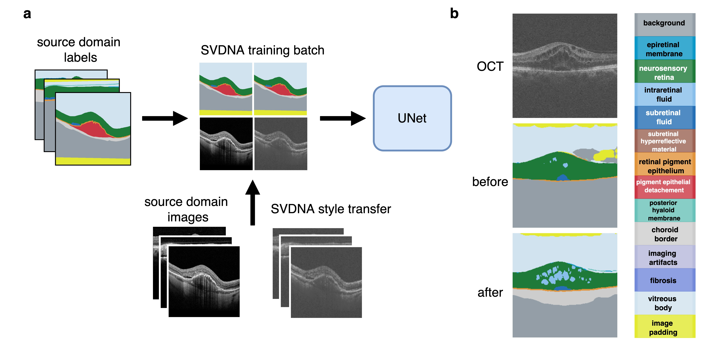

# Noise Transfer for Unsupervised Domain Adaptation of Retinal OCT Images

The github repository of the paper "[Noise Transfer for Unsupervised Domain Adaptation of Retinal OCT Images](http://arxiv.org/abs/2209.08097)" that was accepted at MICCAI 2022.

In our work we propose a simple Singular Value Decomposition based Noise Adaptation algorithm (SVDNA) to bridge the domain gap between retinal OCT images taken with different devices and improve segmentation performance. We use SVDNA to restyle images during training to match noise and pixel intensity distribution patterns of target domains. These restyled images are then used to train a model that generalizes to multiple target domains at once. We find that despite its simplicity, SVDNA trained models outperform more complicated state-of-the-art methods.

*Figure 1. Training scheme* 

## Demo
We provide a sample [notebook](https://colab.research.google.com/drive/1SO57y3u4JxGkltChlX6kVAnGLLYeRev0#scrollTo=Y8d3_BPrBjW0) where you can try out the SVDNA style transfer yourself, datasets to test style transfer can be requested at the [page of the RETOUCH challenge](https://retouch.grand-challenge.org/)[1], one public dataset is available to download [here](https://www.kaggle.com/datasets/paultimothymooney/farsiu-2014). 

*Figure 2. Sample restyling to images from three different domains*. 
The code used to train our model will be released soon.

## Cite
Please cite our work if you find it uesful to your research.
```
@InProceedings{10.1007/978-3-031-16434-7_67,
author="Koch, Valentin and Holmberg, Olle and Spitzer, Hannah and Schiefelbein, Johannes and Asani, Ben and Hafner, Michael and Theis, Fabian J.",
editor="Wang, Linwei and Dou, Qi and Fletcher, P. Thomas and Speidel, Stefanie and Li, Shuo",
title="Noise Transfer for Unsupervised Domain Adaptation of Retinal OCT Images",
booktitle="Medical Image Computing and Computer Assisted Intervention -- MICCAI 2022",
year="2022",
publisher="Springer Nature Switzerland",
address="Cham",
pages="699--708"
}

```
## References

[1] Hrvoje Bogunovic, Freerk Venhuizen, Sophie Klimscha, Stefanos Apostolopoulos, Alireza Bab-Hadiashar, Ulas Bagci, Mirza Faisal Beg, Loza Bekalo, Qiang Chen, Carlos Ciller, Karthik Gopinath, Amirali K. Gostar, Kiwan Jeon, Zexuan Ji, Sung Ho Kang, Dara D. Koozekanani, Donghuan Lu, Dustin Morley, Keshab K. Parhi, Hyoung Suk Park, Abdolreza Rashno, Marinko Sarunic, Saad Shaikh, Jayanthi Sivaswamy, Ruwan Tennakoon, Shivin Yadav, Sandro De Zanet, Sebastian M. Waldstein, Bianca S. Gerendas, Caroline Klaver, Clara I. Sanchez, Ursula Schmidt-Erfurth. RETOUCH -The Retinal OCT Fluid Detection and Segmentation Benchmark and Challenge, IEEE Transactions on Medical Imaging, vol 38(8), pp. 1858-1874, 2019.
[DOI: 10.1109/TMI.2019.2901398] 
